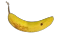
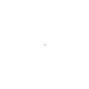
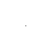
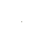

## What is Neural Cellular Automata?
Have you head of cellular automata? They can be considered as simulation with very simples that looks chaotic at beginning and after some iterations these create a visually appealing patterns. You can refer to [this site](https://en.wikipedia.org/wiki/Cellular_automaton) as a demo. The key takeaway is all this simulation depends on simple patterns like if you are on black go right and turn the square to white and similar.

We extend this concept to store the image of banana. Here, the simple rules are learned by the neural network such that at each step each cell independently change themself slowly converging to create the image of banana. Note that the banana generated is just cell interacting with each other and evolving themself to create banana.

For more details [refer to this amazing interactive research paper](https://distill.pub/2020/growing-ca/).

## Usage
- `train-automata.py` is used to train neural cellular automata to generate the specific picture **(store)**,
- `test-automata.py` is used to create video of neural cellular automata generating the picture **(retreive)**.

During, training a log file named `training.json` will be created inside `outputs` folder, which is required to create the video.

## Demo
### Storing the Image
The model is trained to generate the rules to store the image for **8000 epochs**. The model starts with a image that contains a black dot in the middle and it slowly grows to the image of banana later. 

Notice the black dot, the model evolves from that dot.

During each epoch, we saved what the model has learned and the video of model learning to evolve is below.

### Displaying the Image
The below video shows how the model slowly evolves from random seed, interact with each other to converge into banana.

